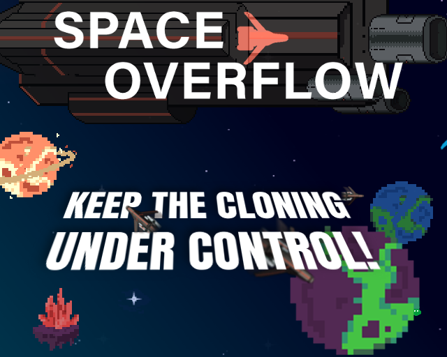

# SpaceOverflow - A [Ludum Dare](https://ldjam.com/) JAM entry
* Title: Space Overflow
* Clicker/Strategy
* Using Phaser.JS
* JAM Entry

###  Licence
[Creative Commons BY NC SA (attribution, NO commercial use, share alike)](https://creativecommons.org/licenses/by-nc-sa/2.0/)

###  Contributors
* Code: 
  * [Vincent Duplessis](https://github.com/PoissonSoluble/)
  * Pierre Gabon
  * [Yann Pellegrini](https://yann-p.fr)
* Art: Kevin Pieplu

###  Music Credits
Hicham Chahidi

Warning: this is code written for a jam in 72h and it may hurt your eyes ;)

##  [Play](https://yann-p.fr/ld40) -  [Ludum Dare entry page](https://ldjam.com/events/ludum-dare/40/space-overflow)

##  Screenshots

